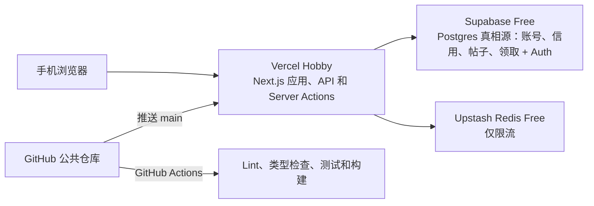

# 零预算部署与开源指南

本文说明如何把“周三充值日拼图互助”以 **0 元预算**部署到 Vercel，数据真相源使用 **Supabase Postgres 免费方案**，Upstash Redis 免费方案只做限流。后半部分说明如何将仓库按 **GNU Affero General Public License v3.0（AGPL-3.0）**开源。

文档基于 2026-08-06 的官方页面和当前仓库状态编写。Vercel、Supabase、Upstash 和 GitHub 可能调整控制台名称或免费额度，正式操作时应再次查看文末官方链接。

## 1. 最终架构



最终使用的免费资源：

| 服务 | 用途 | 选择 |
| --- | --- | --- |
| GitHub Free | 公共源码、Issue、Pull Request、CI | 公共仓库 |
| Vercel Hobby | Next.js 托管和 Serverless API | 免费 `*.vercel.app` 域名 |
| Supabase Free | Postgres 数据真相源 + Auth 账号 | 一个 Free 项目 |
| Upstash Redis Free | 仅限流(发布/领取/注册) | 一个 Free 数据库 |

不购买域名，不开通 Vercel Pro，不启用 Vercel Marketplace 付费集成，不把 Supabase 项目或 Upstash 数据库升级到付费方案。

## 2. 零预算边界

### 2.1 Vercel Hobby

Vercel 官方说明 Hobby 是免费方案，面向个人项目和小规模应用。超过多数用量限制后，相关能力会暂停，等待额度周期恢复，而不是自动按量收费。

必须注意：Vercel Hobby 的公平使用规则限制为 **个人、非商业用途**。本项目可以作为个人、公益、非商业的开源互助工具运行，但不能在 Hobby 上用于公司业务、收费服务、广告变现或其他商业用途。用途发生变化时必须重新评估托管方案。

不要点击 “Start Pro Trial”，也不要添加付费团队成员或启用付费附加功能。

### 2.2 Supabase Free

Supabase Free 提供一个 Postgres 数据库和 Auth。本项目把账号、信用、帖子、领取全部存于 Postgres,并用 plpgsql `SECURITY DEFINER` 函数在单事务内保证并发正确性与信用变动。

必须注意:Supabase Free 项目在长时间无活动后可能被暂停(需在控制台恢复);免费额度(数据库大小、Auth 月活、出站流量)以控制台为准,应定期查看 Project → Usage。选择方案时保持 **Free**,不要升级到 Pro 或添加计费。

### 2.3 Upstash Redis Free

编写本文时，Upstash Redis Free 页面显示：

- 价格：`$0/月`
- 数据容量：256 MB
- 每月命令数：500,000
- 每月流量：10 GB
- 免费方案适合原型和个人项目

本项目 Redis **只用于限流**(发布、领取、注册的滑动窗口计数),不再存帖子或领取回执,占用极小。实际是否够用取决于访问量，应定期查看 Upstash Metrics。

选择数据库方案时必须明确选择 **Free**。不要添加信用卡；Upstash 官方说明添加信用卡会把数据库升级到 Pay as You Go。

### 2.4 中国大陆访问风险

Vercel 免费域名和海外 Serverless 服务在中国大陆的访问速度、DNS 可达性和稳定性没有保证。该方案适合零预算上线验证，但不能承诺生产级可用性。

上线后必须使用中国移动网络、不同地区 Wi-Fi、Android 和 iPhone 真机测试。若 `.vercel.app` 在目标用户地区不可达，需要另行评估国内备案和国内云服务，这通常无法维持完全零成本。

## 3. 当前仓库已经具备的条件

当前项目已经满足 Vercel 默认的 Next.js 部署结构：

- Next.js App Router，根目录是项目根目录
- `package.json` 声明 Node.js 项目和 `pnpm@10.32.1`
- `pnpm-lock.yaml` 已提交，可执行冻结安装
- `.env.example` 包含所有生产环境变量名
- `.gitignore` 已忽略 `.env*`、`.vercel`、`.next`、测试报告和依赖目录
- `.github/workflows/ci.yml` 已包含 lint、类型检查、单元测试、构建和 E2E
- 数据真相源是 Supabase Postgres;帖子带 `expires_at` 列,读取时过滤已过期
- 账号用 `@supabase/ssr` 会话 Cookie;`SUPABASE_SERVICE_ROLE_KEY` 仅服务端 Server Action 调 RPC
- 服务端限流使用 `@upstash/redis` 的 `Redis.fromEnv()`,数据库迁移在 `supabase/migrations/`

不需要新增 `vercel.json`。Vercel 会自动识别 Next.js、pnpm 和构建命令。

`package.json` 中的 `"private": true` 只表示禁止误发布到 npm，不会阻止 GitHub 仓库公开。

编写本文时，本地仓库还没有配置 GitHub remote，仓库中也没有开源许可证文件。

## 4. 准备账号

需要四个免费账号：

1. GitHub：<https://github.com/signup>
2. Vercel：<https://vercel.com/signup>
3. Supabase：<https://supabase.com/dashboard>
4. Upstash：<https://console.upstash.com>

建议 Vercel、Supabase 和 Upstash 都使用 GitHub 登录，减少额外密码。为 GitHub 开启双重验证，并妥善保存恢复码。

## 5. 公开前安全检查

先打开 PowerShell，进入项目目录：

```powershell
Set-Location 'F:\cursor\cmcc-puzzle-hub'
```

确认工作区状态：

```powershell
git status --short
```

没有输出表示工作区干净。查看将公开的文件：

```powershell
git ls-files
```

确认以下内容没有被跟踪：

- `.env`
- `.env.local`
- `.vercel/`
- `SUPABASE_SERVICE_ROLE_KEY` 的真实值
- Upstash REST Token
- GitHub Personal Access Token
- Vercel Token

检查环境文件是否被 Git 跟踪：

```powershell
git ls-files .env .env.local .env.production
```

预期没有输出。检查当前提交内容中是否出现常见密钥前缀：

```powershell
git grep -n -I -E -e 'UPSTASH_REDIS_REST_TOKEN=[A-Za-z0-9._-]{20,}' -e 'SUPABASE_SERVICE_ROLE_KEY=[A-Za-z0-9._-]{20}' -e 'eyJ[A-Za-z0-9._-]{20}' -e 'ghp_[A-Za-z0-9]{20,}' -e 'vercel_[A-Za-z0-9._-]{20,}'
```

该命令按真实凭证常见的长度和字符集匹配，因此不会把本指南中的中文占位符或 `.env.example` 中的空值误判为密钥。预期没有输出；若命令显示真实凭证，不要继续公开仓库：先从 Git 历史中清理，再到相应平台旋转或撤销凭证。仅删除当前文件不等于从 Git 历史删除。自动扫描不能覆盖所有凭证格式，公开前仍要人工检查本节列出的敏感内容。

执行本地门禁：

```powershell
pnpm install --frozen-lockfile
```

```powershell
pnpm lint
```

```powershell
pnpm typecheck
```

```powershell
pnpm test:unit
```

```powershell
pnpm build
```

集成测试需要专用测试数据库；零预算只有一个生产 Free 数据库时，不要把生产凭证用于集成测试。

## 6. 添加 AGPL-3.0 许可证

AGPL-3.0 允许使用、修改和再分发，但修改后的程序通过网络向用户提供服务时，运营者也需要向这些用户提供对应源码。这正适合防止他人闭源部署本项目的修改版本。

从 GNU 官方地址下载完整许可证到仓库根目录：

```powershell
Invoke-WebRequest -Uri 'https://www.gnu.org/licenses/agpl-3.0.txt' -OutFile '.\LICENSE'
```

检查文件开头：

```powershell
Get-Content -LiteralPath '.\LICENSE' -TotalCount 8
```

预期包含：

```text
GNU AFFERO GENERAL PUBLIC LICENSE
Version 3, 19 November 2007
```

将许可证加入 Git：

```powershell
git add LICENSE
```

```powershell
git commit -m "docs: license project under AGPL-3.0"
```

开源后的 README 和在线页面应提供源码仓库链接。第三方若部署修改版，也应向该在线服务的用户提供对应源码，不能只保留一个没有指向修改源码的原始项目链接。

## 7. 开源免责声明

在公开仓库前，应在 README 的项目介绍附近加入以下含义的声明：

```markdown
## 免责声明

本项目是社区维护的非官方开源工具，与中国移动通信集团有限公司及其关联公司无隶属、授权、赞助或背书关系。“中国移动”及相关商标归其权利人所有。

本项目不保证第三方活动接口、口令、二维码、Deep Link 或客户端行为长期有效。使用者应遵守活动规则、平台条款和适用法律，并自行承担使用风险。
```

不要声称项目是“中国移动官方平台”。仓库名称、描述、截图和部署页面都应保持“非官方社区工具”的定位。

公开截图和 Issue 时，不要展示仍有效的真实领取口令、完整分享 URL、手机号、用户名、Supabase/Redis 密钥或服务端日志中的敏感值。

## 8. 创建 GitHub 公共仓库

可以选择网页方式或 GitHub CLI，二选一即可。

### 8.1 网页方式

1. 登录 <https://github.com>。
2. 点击右上角 `+`，选择 `New repository`。
3. Repository name 填写 `cmcc-puzzle-hub`。
4. Description 可填写：`非官方的中国移动周三充值日拼图互助 H5`。
5. 选择 `Public`。
6. **不要**勾选 Add a README、Add .gitignore 或 Choose a license，因为本地仓库已经包含历史和相关文件。
7. 点击 `Create repository`。
8. 复制仓库 HTTPS 地址，例如 `https://github.com/你的用户名/cmcc-puzzle-hub.git`。

在 PowerShell 中添加远程仓库。把示例 URL 替换成自己的地址：

```powershell
git remote add origin 'https://github.com/你的用户名/cmcc-puzzle-hub.git'
```

确认地址：

```powershell
git remote -v
```

首次推送：

```powershell
git push -u origin main
```

GitHub 不再接受账号密码作为 Git 推送密码。Windows 上通常会由 Git Credential Manager 打开浏览器完成授权。

### 8.2 GitHub CLI 方式

确认 GitHub CLI 已登录：

```powershell
gh auth status
```

若未登录：

```powershell
gh auth login
```

创建公共仓库、添加 `origin` 并推送当前提交：

```powershell
gh repo create cmcc-puzzle-hub --public --source . --remote origin --push
```

不要同时执行网页方式和 CLI 方式，否则可能遇到 remote 已存在或仓库名冲突。

## 9. 配置 GitHub 开源页面

推送后进入 GitHub 仓库，完成以下设置：

1. 点击右侧 About 区域的齿轮。
2. 添加 Description。
3. 添加 Topics：`nextjs`、`react`、`upstash`、`redis`、`vercel`、`puzzle`、`china-mobile`。
4. 暂时不要填写 Website；Vercel 部署完成后再填写免费域名。
5. 在 Settings → General → Features 中启用 Issues 和 Discussions（Discussions 可选）。
6. 在 Settings → Code security and analysis 中启用 Dependency graph、Dependabot alerts 和 Secret scanning 可用项。
7. 在 Settings → Security → Private vulnerability reporting 中启用私密漏洞报告，避免安全问题直接公开在 Issue。

建议后续补充：

- `CONTRIBUTING.md`：开发环境、测试命令和 Pull Request 规则
- `SECURITY.md`：私密漏洞报告方式和支持版本
- `CODE_OF_CONDUCT.md`：社区行为准则
- `.github/ISSUE_TEMPLATE/`：Bug 和功能请求模板
- `.github/pull_request_template.md`：测试清单

这些文件不包含生产密钥，也不需要 Vercel 配置。

## 10. 创建 Upstash Redis Free 数据库

1. 打开 <https://console.upstash.com> 并登录。
2. 进入 `Redis` 标签。
3. 点击右上角 `+ Create Database`。
4. Database Name 填写 `cmcc-puzzle-hub-prod`。
5. Primary Region 选择距离主要用户和 Vercel Functions 较近的可用区域。免费方案可用区域以控制台为准。
6. 不添加额外 Read Region，减少复杂度和命令复制。
7. 点击 `Next`。
8. 明确选择 `Free`，确认价格是 `$0`。
9. 不选择 Pay as You Go、Fixed 或 Prod Pack。
10. 创建数据库。

进入数据库详情页，找到 REST API 或 Connect 区域，复制：

- `UPSTASH_REDIS_REST_URL`
- `UPSTASH_REDIS_REST_TOKEN`

不要使用只读 Token；本项目需要写入以维护限流计数。不要把 Token 粘贴到聊天、Issue、README 或代码文件中。

## 11. 创建 Supabase 项目并执行迁移

1. 打开 <https://supabase.com/dashboard> 并登录。
2. 点击 `New project`,选择个人组织,填写项目名(如 `cmcc-puzzle-hub`),设置一个数据库密码(妥善保存),Region 选择离用户较近的可用区,方案保持 **Free**。
3. 项目创建完成后,进入 Project Settings → API,复制三项(不要粘贴到聊天或 Git):
   - Project URL → `NEXT_PUBLIC_SUPABASE_URL`
   - `anon` `public` key → `NEXT_PUBLIC_SUPABASE_ANON_KEY`(可公开,受 RLS 约束)
   - `service_role` `secret` key → `SUPABASE_SERVICE_ROLE_KEY`(**权限极高,只在服务端用,绝不进浏览器/Git**)
4. 进入 Database → Extensions,确认 `pg_cron` 可用；`0005` 也会执行 `create extension if not exists pg_cron with schema extensions`。
5. 进入 SQL Editor,依次粘贴执行 `supabase/migrations/` 下的 `0001`→`0002`→`0003`→`0004`→`0005`(建表、RLS、plpgsql 函数、用户名审核、求助托管确认与 Cron)。
6. 在 SQL Editor 验证 5 分钟维护任务已启用:

   ```sql
   select jobname, schedule, command, active
   from cron.job
   where jobname = 'cmcc-request-help-maintenance';
   ```

   预期 `schedule` 为 `*/5 * * * *`、`active=true`、命令为 `select public.sync_request_maintenance()`。
7. 进入 Authentication → Providers/Settings,**关闭邮箱确认(Confirm email)**。本项目用合成邮箱,收不到确认邮件,不关会导致登录失败。
8. (可选)在 SQL Editor 配置信用上限 GUC;留空则用函数内默认(种子 1、每日封顶 5):

   ```sql
   alter database postgres set app.seed_credits = '1';
   alter database postgres set app.earn_cap_per_day = '5';
   ```

9. 注册第一个账号后,在 SQL Editor 手动把它设为管理员:

   ```sql
   update profiles set is_admin = true, status = 'APPROVED' where username = '你的用户名';
   ```

后续新用户在 `/admin` 页由管理员核对微信群昵称后审核通过。

## 12. 可选：本地连接免费数据库

从模板创建本地环境文件：

```powershell
Copy-Item -LiteralPath '.env.example' -Destination '.env.local'
```

打开文件：

```powershell
notepad .env.local
```

填写真实值：

```dotenv
NEXT_PUBLIC_SUPABASE_URL=https://你的项目.supabase.co
NEXT_PUBLIC_SUPABASE_ANON_KEY=你的 anon key
SUPABASE_SERVICE_ROLE_KEY=你的 service_role key
UPSTASH_REDIS_REST_URL=https://你的数据库地址
UPSTASH_REDIS_REST_TOKEN=你的REST_TOKEN
PUBLISH_LIMIT_PER_HOUR=10
```

保存后确认该文件仍被忽略：

```powershell
git check-ignore -v .env.local
```

启动项目：

```powershell
pnpm dev
```

打开 <http://localhost:3000>，确认大厅不再显示“加载失败，请重试”。

## 13. 导入 Vercel

1. 打开 <https://vercel.com>。
2. 使用 GitHub 登录。
3. 选择 Hobby 个人账号，不创建或升级付费 Team。
4. 在 Dashboard 点击 `Add New...` → `Project`。
5. 首次使用时，授权 Vercel GitHub App 访问仓库。建议选择 `Only select repositories`，只授权 `cmcc-puzzle-hub`。
6. 在仓库列表找到 `cmcc-puzzle-hub`，点击 `Import`。
7. Project Name 可保持 `cmcc-puzzle-hub`。
8. Framework Preset 应自动识别为 `Next.js`。
9. Root Directory 保持 `./`。
10. Build Command 保持默认 `next build` 或项目自动检测值。
11. Install Command 保持自动检测；Vercel 会根据 `packageManager` 使用 pnpm。
12. Node.js Version 选择 22.x。如果导入页没有该选项，部署后到 Project Settings → Build and Deployment 设置。

先不要点击 Deploy，展开 Environment Variables。

## 14. 配置 Vercel 环境变量

逐个添加以下变量：

| Name | Value | 是否敏感 | 建议环境 |
| --- | --- | --- | --- |
| `NEXT_PUBLIC_SUPABASE_URL` | Supabase Project URL | 否 | Production |
| `NEXT_PUBLIC_SUPABASE_ANON_KEY` | Supabase anon key | 否(受 RLS 约束) | Production |
| `SUPABASE_SERVICE_ROLE_KEY` | Supabase service_role key | 是(权限极高) | Production |
| `UPSTASH_REDIS_REST_URL` | Upstash REST URL | 是 | Production |
| `UPSTASH_REDIS_REST_TOKEN` | Upstash REST Token | 是 | Production |
| `PUBLISH_LIMIT_PER_HOUR` | `10`，访问量增大时可降到 `5` | 否 | Production |
| `PUBLISH_LIMIT_PER_DAY` | `10` | 否 | Production |
| `CLAIM_LIMIT_PER_DAY` | `10` | 否 | Production |
| `REGISTER_LIMIT_PER_DAY_PER_IP` | `3` | 否 | Production |

第一轮只选 Production，避免未审查的 Preview 代码接触生产数据库。`SUPABASE_SERVICE_ROLE_KEY` **不要**加 `NEXT_PUBLIC_` 前缀,否则会被打包进浏览器端,绕过全部 RLS。

如果以后需要自己的 Preview 部署读写数据，有两个选择：

1. 继续只给受信任分支授权，并把相同变量添加到 Preview。缺点是预览会读写生产 Supabase/Redis。
2. 使用独立的测试 Supabase 项目和 Redis。隔离更安全，但需自行管理迁移与额度。

对零预算项目，推荐保持 Production-only。来自 fork 的 Pull Request 默认需要仓库成员授权才会创建 Vercel Preview；不要授权尚未审查的外部 PR 部署，因为恶意代码可能读取服务端环境变量。

Vercel 环境变量修改只对新部署生效。修改后必须重新部署。

## 15. 首次部署

环境变量填写完成后点击 `Deploy`。

Vercel 将执行：

1. 从 GitHub 拉取代码。
2. 根据锁文件安装 pnpm 依赖。
3. 运行 Next.js 生产构建。
4. 创建静态页面和 Serverless API。
5. 分配 `https://项目名.vercel.app` 域名。

部署成功后点击 `Visit`。如果项目名已被占用，Vercel 会生成不同的免费子域名，以 Dashboard 中显示的地址为准。

把正式地址写入 GitHub 仓库 About 的 Website 字段，并在 README 增加：

```markdown
在线体验：<https://你的项目地址.vercel.app>

源码：<https://github.com/你的用户名/cmcc-puzzle-hub>
```

在线页面也应能找到源码链接，以明确满足 AGPL-3.0 网络服务场景下的源码提供要求。

## 16. 上线验收

先验证基础页面：

1. 打开大厅，确认不显示 503 或“加载失败”。
2. 注册一个账号,在 Supabase 手动设为管理员,登录后确认能进 `/admin` 并审核用户。
3. 用已审核账号选择拼图，分别验证口令、二维码和双来源发布,并确认信用扣减/发放正确。
4. 返回大厅，确认卡片显示正确来源与发布者公开标识。
5. 使用另一个已审核账号领取。

再进行真机验证：

1. Android + 中国移动网络。
2. iPhone + 中国移动网络。
3. 剪贴板写入成功后才调用 `leadeon://`。
4. 中国移动 APP 能被系统唤起。
5. APP 未唤起时页面显示“请手动打开中国移动 APP”。
6. 链接领取只跳转到项目白名单允许的中国移动 URL。
7. 二维码图片没有出现在浏览器网络请求中。
8. 同一内容不能重复发布。
9. 同一帖子只有第一个领取者成功。
10. 发布者不能领取自己发布的帖子。

Vercel 使用 HTTPS，满足现代浏览器剪贴板 API 的安全上下文要求，但 iOS、Android、微信内置浏览器和不同系统版本仍可能有权限差异，桌面 E2E 不能替代真机验收。

## 17. 自动部署和 CI/CD

GitHub 和 Vercel 关联后：

- 推送 `main`：触发 GitHub Actions，并触发 Vercel Production 部署。
- 推送其他分支：触发 GitHub Actions，并可能产生 Vercel Preview。
- 创建 Pull Request：GitHub Actions 检查代码；Vercel 根据授权策略生成 Preview。

日常更新建议：

```powershell
git status --short
```

```powershell
pnpm lint
```

```powershell
pnpm typecheck
```

```powershell
pnpm test:unit
```

```powershell
pnpm build
```

```powershell
git add 需要提交的文件
```

```powershell
git commit -m "feat: 描述本次变更"
```

```powershell
git push
```

当前 GitHub Actions 中的 Upstash 集成测试只在配置以下 GitHub Secrets 时运行：

- `TEST_UPSTASH_REDIS_REST_URL`
- `TEST_UPSTASH_REDIS_REST_TOKEN`

零预算只有一个生产数据库时，**不要**把生产数据库凭证配置为测试 Secret。保持这两个 Secret 缺失，CI 会跳过 Redis 集成测试，其余检查仍会运行。

Vercel 的生产环境变量不需要复制到 GitHub Secrets；GitHub Actions 当前不会部署 Vercel，也不会访问生产 Redis。

## 18. 回滚

### 18.1 Git 回滚

查看最近提交：

```powershell
git log --oneline -10
```

创建一个反向提交：

```powershell
git revert 需要回滚的提交哈希
```

推送后，Vercel 会自动部署回滚结果：

```powershell
git push
```

不要用 `git reset --hard` 或强制推送处理已经公开的 `main` 历史。

### 18.2 Vercel 即时恢复

紧急情况下可进入 Vercel Project → Deployments，打开上一个正常部署，使用 `Promote to Production` 或重新部署。之后仍应在 Git 中执行 `git revert`，让仓库历史和线上版本保持一致。

## 19. 免费额度保护

### 19.1 Supabase

每周查看 Project → Usage 中的数据库大小、Auth 月活和出站流量。保护措施：

- 确认 `cmcc-request-help-maintenance` 每 5 分钟调用 `sync_request_maintenance()`，处理自动确认、到期退款、赠送过期和去重行。
- 二维码图片不入库,只存规范化口令和 URL。
- 长时间无访问会被暂停,上线前在控制台确认项目处于活动状态。
- 保持 Free 方案,不添加计费。

### 19.2 Upstash

每周查看 Upstash Console 中的：

- Commands
- Data Size
- Bandwidth
- Errors 或 Rate Limit

保护措施：

- Redis 只存限流计数,滑动窗口键会自然过期,占用极小。
- 保持发布频率限制，异常流量时把 `PUBLISH_LIMIT_PER_HOUR` 从 `10` 调低。
- 不创建多个无用途数据库。
- 不添加信用卡，不升级计划。

### 19.3 Vercel

每周查看 Dashboard → Usage。Hobby 超额后通常暂停对应能力，等待额度恢复。

保护措施：

- 不开启 Pro Trial。
- 不创建付费 Team。
- 不安装可能计费的 Marketplace Add-on。
- 不启用不需要的 Analytics、Blob、AI 或其他附加服务。
- 避免自动化脚本高频推送，Vercel 每次 push 都可能触发部署。
- 项目保持个人、非商业用途。

### 19.4 流量异常

账号是唯一身份与信用主键;新建账号接近免费,信用制挡的是顺手薅的普通用户,挡不住铁心刷号者(Sybil)。真正的反多账号靠**微信群成员身份 + 人工审核**。免费方案出现滥用时：

1. 在 Vercel 查看 Functions 和 Firewall 日志;在 Supabase 查看异常注册/领取。
2. 收紧审核:`/admin` 页对同 IP 标黄的待审核用户从严核对群昵称。
3. 临时调低 `PUBLISH_LIMIT_PER_HOUR`/`CLAIM_LIMIT_PER_DAY`/`REGISTER_LIMIT_PER_DAY_PER_IP` 并重新部署。
4. 使用 Vercel Hobby 可用的 WAF/IP 规则做有限拦截。
5. 必要时暂时关闭项目或把生产部署保护起来。
6. 不要为了维持服务而直接升级付费方案，先确认流量来源。

## 20. 常见错误

### 大厅显示“加载失败，请重试”

优先检查 Vercel Project → Settings → Environment Variables：

- Supabase 三项与 Upstash 两项变量名是否完全一致(注意 `SUPABASE_SERVICE_ROLE_KEY` **不加** `NEXT_PUBLIC_` 前缀)。
- key/Token 是否复制完整。
- 是否选择 Production。
- 修改变量后是否重新部署。

若变量无误,多半是 **Supabase 迁移未执行**(大厅走 `list_hall_posts` RPC,函数不存在即报错)。在 Supabase SQL Editor 跑 `select proname from pg_proc where proname in ('list_hall_posts', 'sync_request_maintenance');`,缺少任一函数都说明 `0001`→`0005` 未全部执行。

若求助长时间未自动确认或退款，先查询 `cron.job` 是否存在 `cmcc-request-help-maintenance`。可在 SQL Editor 以管理员身份手动执行并查看结果:

```sql
select public.sync_request_maintenance();
```

该维护函数仅授予数据库 `service_role`，应用不提供公共 HTTP 维护接口。

然后到 Deployments → 当前部署 → Functions/Runtime Logs 查找 `SERVICE_UNAVAILABLE`。日志会带 `detail` 字段指出真实原因(如函数缺失或环境变量缺失);服务端日志有意不记录口令、完整 URL 或 Token。

### Vercel 构建失败

在本地重新运行：

```powershell
pnpm install --frozen-lockfile
```

```powershell
pnpm build
```

确认 Vercel 使用 Node.js 22，Root Directory 是仓库根目录，锁文件已提交。

### Git push 被拒绝

如果 GitHub 仓库创建时误选了 README 或 License，远端会比本地多一个初始提交。最简单的处理方式是删除刚创建且尚无人使用的 GitHub 仓库，重新创建空仓库，再执行 `git push -u origin main`。不要用强制推送覆盖不确定的远端历史。

### Upstash 达到免费额度

确认数据库仍是 Free，而不是付费方案。Free 达到限制时应接受限流或等待下个月额度恢复，不要添加信用卡自动扩容。检查是否存在异常发布流量，并确认 `sync_request_maintenance()` 与对应 Cron 正常运行。

### 环境变量泄露

1. 若 `SUPABASE_SERVICE_ROLE_KEY` 泄露:立即在 Supabase Project Settings → API 轮换 service_role key。
2. 若 Upstash Token 泄露:在 Upstash 重置或轮换 REST Token。
3. 在 Vercel 更新对应变量并重新部署。
4. 删除公开位置中的值并清理 Git 历史。
5. Git 历史清理完成后仍必须轮换凭证，因为旧值可能已经被复制。

## 21. AGPL-3.0 开源发布清单

公开发布前逐项确认：

- [ ] 根目录存在完整 `LICENSE`，内容为 GNU AGPL v3.0。
- [ ] README 明确标注 `AGPL-3.0`。
- [ ] README 包含中国移动非官方免责声明。
- [ ] README 包含在线地址和源码地址。
- [ ] 在线页面向用户提供对应源码仓库链接。
- [ ] `.env.local`、Token 和 Secret 未被 Git 跟踪。
- [ ] Git 历史中没有已泄露凭证。
- [ ] 真实口令、完整分享链接和手机号未出现在公开截图或 Issue。
- [ ] GitHub About 已配置描述、网址和 Topics。
- [ ] 已启用 Dependabot、Secret scanning 可用项和私密漏洞报告。
- [ ] `main` 分支的 GitHub Actions 通过。
- [ ] Vercel Production 部署通过。
- [ ] Supabase 迁移 `0001`→`0005` 已全部执行，`pg_cron` 维护任务有效，邮箱确认已关闭，首个管理员已设置。
- [ ] Android 和 iPhone 真机验收完成。
- [ ] Vercel 项目保持 Hobby、个人、非商业用途。
- [ ] Supabase 项目与 Upstash 数据库保持 Free，未添加信用卡。
- [ ] `SUPABASE_SERVICE_ROLE_KEY` 未加 `NEXT_PUBLIC_` 前缀,未进浏览器端。

建议发布首个版本标签：

```powershell
git tag -a v0.1.0 -m "First public release"
```

```powershell
git push origin v0.1.0
```

然后在 GitHub Releases 中基于 `v0.1.0` 创建 Release，说明主要功能、部署方式、已知限制和真机兼容情况。

## 22. 官方参考

- Vercel Hobby：<https://vercel.com/docs/plans/hobby>
- Vercel GitHub 自动部署：<https://vercel.com/docs/git/vercel-for-github>
- Vercel 环境变量：<https://vercel.com/docs/projects/environment-variables>
- Vercel 公平使用规则：<https://vercel.com/docs/limits/fair-use-guidelines>
- Supabase 定价与免费方案：<https://supabase.com/pricing>
- Supabase API keys(anon/service_role)：<https://supabase.com/docs/guides/api/api-keys>
- Supabase 数据库迁移：<https://supabase.com/docs/guides/deployment/database-migrations>
- Upstash Redis 入门：<https://upstash.com/docs/redis/overall/getstarted>
- Upstash Redis 定价和限制：<https://upstash.com/pricing/redis>
- GitHub 推送本地代码：<https://docs.github.com/en/migrations/importing-source-code/using-the-command-line-to-import-source-code/adding-locally-hosted-code-to-github>
- GitHub 添加许可证：<https://docs.github.com/en/communities/setting-up-your-project-for-healthy-contributions/adding-a-license-to-a-repository>
- GNU AGPL-3.0 正文：<https://www.gnu.org/licenses/agpl-3.0.txt>
- SPDX AGPL-3.0-only：<https://spdx.org/licenses/AGPL-3.0-only.html>
